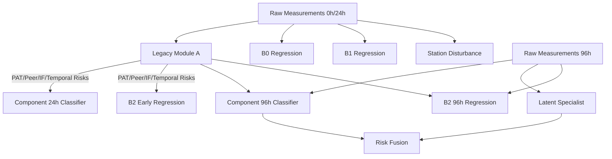

# PHASE 0B — MODEL ARCHITECTURE

## 1. End-to-End Model Pipeline
1. **Module A (Legacy)**: Calculates `PAT_Risk`, `Peer_Risk`, `Temporal_Risk`, `IF_Risk` from 0h and 24h measurements.
2. **Module A (New Early)**: `component_24h_classifier.pkl` predicts early anomalies using 0h/24h metrics + legacy Module A risks.
3. **Module B (New Early)**: `B0`, `B1`, or `B2_Early` predict 168h values. `B2_Early` requires the legacy Module A risks.
4. **Module A (New Late)**: `component_96h_classifier.pkl` and `latent_specialist.pkl` detect anomalies using 96h data and deltas.
5. **Module B (New Late)**: `B2_96h` predicts 168h values incorporating 96h data and legacy risks.
6. **Station Analysis**: `station_disturbance_classifier.pkl` evaluates station-level behavior.
7. **Risk Fusion**: `fusion_96h_classifier.pkl` combines the scores (`Supervised_Score`, `Component_96h_Score`, `Late_Drift_Risk`) to output a final fusion probability.

## 2. Checkpoint Requirements & Missing Data
- **0h & 24h**: Required for `B0`, `B1`, `B2_Early`, `component_24h_classifier`, and Station Analysis.
- **96h**: Required for `B2_96h`, `component_96h_classifier`, `latent_specialist`, and Fusion.
- If checkpoints are missing, models must explicitly fail or return an UNAVAILABLE state rather than fabricating inputs. 

## 3. Model Dependency Graph

## 4. Module Mapping
- **Module A**: `component_24h_classifier.pkl`, `component_96h_classifier.pkl`, `latent_specialist.pkl` (plus legacy artifacts)
- **Module B**: `B0`, `B1`, `B2_Early`, `B2_96h` models for IDDQ, Leakage, Delay
- **Station Analysis**: `station_disturbance_classifier.pkl`
- **Risk Fusion**: `fusion_96h_classifier.pkl`
- **Supporting Configuration**: `inference_configuration.pkl`

## 5. Database Persistence Requirements
Phase 1 will require the following DB fields for explicit persistence:
- `predicted_168h` (from B0/B1/B2 Regression models)
- `component_24h_score` (from `component_24h_classifier`)
- `component_96h_score` (from `component_96h_classifier`)
- `latent_specialist_score`
- `fusion_score` / `final_decision`
- `station_disturbance_flag`
- A structural change to support explicitly row-based or JSON-nested 0h, 24h, 96h, 168h checkpoints to avoid flattening logic.

## 6. API Requirements
- Dynamic fetching of parameters per checkpoint without fallback logical `or`.
- Endpoints must explicitly pass `UNAVAILABLE` or raise 4xx when dependent checkpoints (e.g., 96h) are missing.
- Model versions must be tracked (via hash or name) and returned in responses.

## 7. Model Versioning
Models will be version-tracked by filename and inference configuration keys. `inference_configuration.pkl` will serve as the master key for feature array bindings and decision thresholds.

## 8. Old vs New Artifact Comparison
1. **Is B1 now available?** YES, `B1` models are included.
2. **Is B2-Early now available?** YES.
3. **Is B2-96h now available?** YES.
4. **Are the old PAT/Peer/Temporal/IF artifacts present?** NO, they are missing from the zip.
5. **Are there new models replacing them?** NO, the new models ingest their outputs as features (`PAT_Risk`, etc.).
6. **Are the old Module A signals still required?** YES.
7. **Does the new package represent a new inference architecture?** YES, an expanded cascade where old Module A feeds a new meta-classifier layer.
8. **Obsolete Assumptions:** That Module A outputs directly drive the decision. Now they feed `component_24h_classifier` and `fusion_96h_classifier`.
9. **Valid Assumptions:** Time checkpoints (0h, 24h, 96h) remain strictly enforced.
