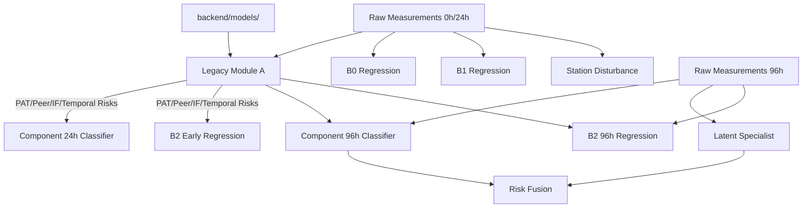

# PHASE 0C — MODEL ARCHITECTURE (VERIFIED)

## 1. End-to-End Model Pipeline
1. **LEGACY MODULE A (DEPENDENCY)**: Loads `pat_reference.pkl`, `peer_knn.pkl`, `temporal_reference.pkl`, `isolation_forest.pkl` from `backend/models/`. Calculates `PAT_Risk`, `Peer_Risk`, `Temporal_Risk`, `IF_Risk` from 0h and 24h measurements. *Status: VERIFIED AND AVAILABLE.*
2. **NEW EARLY MODULE A**: `component_24h_classifier.pkl` predicts early anomalies using 0h/24h metrics + legacy Module A risks.
3. **MODULE B (EARLY)**: `B0`, `B1`, or `B2_Early` predict 168h values. `B2_Early` requires the legacy Module A risks.
4. **NEW LATE MODULE A**: `component_96h_classifier.pkl` and `latent_specialist.pkl` detect anomalies using 96h data and deltas.
5. **MODULE B (LATE)**: `B2_96h` predicts 168h values incorporating 96h data and legacy risks.
6. **STATION**: `station_disturbance_classifier.pkl` evaluates station-level behavior.
7. **RISK FUSION**: `fusion_96h_classifier.pkl` combines the scores to output a final fusion probability.

## 2. Checkpoint Requirements & Missing Data
- **0h & 24h**: Required for `B0`, `B1`, `B2_Early`, `component_24h_classifier`, and Station Analysis.
- **96h**: Required for `B2_96h`, `component_96h_classifier`, `latent_specialist`, and Fusion.

## 3. Model Dependency Graph

## 4. Database Persistence Requirements
Phase 1 will require explicit persistence fields for checkpoints and scores, moving away from flattened generic limits.
